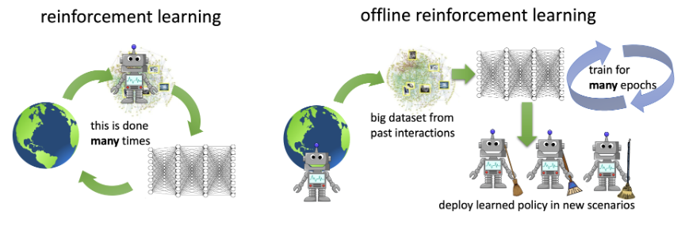



# Offline Reinforcement Learning Lab 🚀

A playground for experimenting with offline Reinforcement Learning (RL) and Imitation Learning (IL) algorithms.
This project leverages [Tianshou](https://github.com/thu-ml/tianshou) for RL implementation and 
[Minari](https://github.com/Farama-Foundation/Minari) for standardized offline RL dataset management. Give a look to the 
[repository](...) for more details. 📚

## Key Concepts: Online vs Offline RL 🧠
The fundamental difference between online and offline RL lies in their learning approaches:
- **Online RL**: Learns through direct interaction with an environment/simulator
- **Offline RL**: Learns from pre-collected datasets generated by behavioral policies, without environment interaction

## Project Features 🔧
- Standardized data collection framework for behavioral policies
- Ready-to-use replay buffer population for offline training
- Focus on both simple and complex environments
- Comprehensive notebooks for learning and experimentation

## Getting Started 🏁
Explore the [notebooks](link-to-notebooks) that demonstrate how to use the library. These notebooks focus on core 
concepts in offline RL, utilizing so far 2D grid environments. These simplified environments provide an ideal learning 
ground as they:
- 🕒 Enable rapid data collection and training.
- 🔍 Provide a clear and detailed examination of state-action pairs, making it easier to identify out of distribution data,
  a critical aspect of Offline RL.
- 🎮 Offer controlled experimentation settings, where environment difficulty can be adjusted by adding obstacles or 
  designing various behavioral policies with ease. 

## More advanced Use Cases 🚘

### Case Study 1: TORCS Racing Simulator

While the initial focus is on simple environments, the tools in this lab can scale to more complex problems. 
For instance, we are integrating the [TORCS](...) race simulator, which enables data collection from suboptimal 
policies. Below is a demonstration of applying **Dataset Aggregation (DAgger)** — a more advanced and robust imitation 
learning algorithm compared to Behavioral Cloning (BC) — in the TORCS environment.

## Dataset Aggregation (DAgger)

DAgger begins with initial training using BC and iteratively improves the policy by rolling out in the environment. 
If new states arise during rollouts, additional feedback is solicited from experts. While effective, this approach 
may be resource-intensive. 

Error in DAgger:
$$ \mathbb{E} \left[ \sum_t c(s_t, a_t) \right] \sim O(\epsilon H) $$
where \( H \) is the trajectory horizon, 
and \( \pi_\theta (a \ne \pi^*(s) | s) \le \epsilon \text{ for all } s \in D_{\text{train}} \). This represents a 
significantly better error compared to Behavioral Cloning (BC), where the error scales with $$H^2$$.

---

### TORCS: DAgger use case
We utilized TORCS, a robust 3D racing simulator. The goal is to teach an agent to navigate a race circuit using lidar 
sensors by learning from an expert policy. 

**Environment Details:**
- **State:** 21 lidar sensors distributed symmetrically from -45° to 45° around the car.
- **Action:** Steering angle.

#### TORCS Overview
TORCS (The Open Racing Car Simulator) is a highly detailed racing simulator with a sophisticated physics engine 
accounting for aerodynamics, wheel rotation, and more. For AI research, TORCS facilitates the addition of independent
AI controllers via UDP connections, enabling realistic autonomous driving experiments.

---

## Results: DAgger in Action

Remember what we need to do:

### 1. Expert Driver
As shown in the video below, the expert (human) driver demonstrates optimal performance.

<html lang="en">
<head>
    <meta charset="UTF-8">
    <meta name="viewport" content="width=device-width, initial-scale=1.0">
    <title>Video Section Example</title>
    
</head>
<body>
    <!-- Video Section -->
    

        <video width="340" height="360" controls>
            <source src="../../assets/videos/expert_driver_dagger.webm" type="video/webm">
            Your browser does not support the video tag.
        </video>
    

</body>
</html>

### 2. Drunk Driver (Behavior Policy)
A suboptimal policy (the "drunk driver") collects data, providing a starting point for offline RL.

<html lang="en">
<head>
    <meta charset="UTF-8">
    <meta name="viewport" content="width=device-width, initial-scale=1.0">
    <title>Video Section Example</title>
    
</head>
<body>
    <!-- Video Section -->
    

        <video width="340" height="360" controls>
            <source src="../../assets/videos/suboptimal_driver_dagger.webm" type="video/webm">
            Your browser does not support the video tag.
        </video>
    

</body>
</html>

### 3. DAgger Improvement
By incorporating expert corrections into the dataset during rollouts, the policy rapidly improves, 
achieving near-expert performance after just a few iterations.

Using expert driver knowledge (first video) to correct the behavioral policy state-action wrong pairs (second video)
after just 4 laps we are able to learn the expert policy, as shown in the next video. 

<html lang="en">
<head>
    <meta charset="UTF-8">
    <meta name="viewport" content="width=device-width, initial-scale=1.0">
    <title>Video Section Example</title>
    
</head>
<body>
    <!-- Video Section -->
    

        <video width="340" height="360" controls>
            <source src="../../assets/videos/optimal_dagger_policy.webm" type="video/webm">
            Your browser does not support the video tag.
        </video>
    

</body>
</html>

---

## In Summary

DAgger is a powerful algorithm, but it requires access to an expert, which can be very costly. Offline RL aims to 
achieve a similar goal; however, if certain state-action pairs are missing from your dataset, it becomes challenging 
for the algorithm to infer or recreate them. In Offline RL, the goal is to go out of distribution in a controlled 
manner. For more details, refer to the notebooks in the repository. 

Since the data collected in the previous exercise is quite bad, this example will be particularly challenging for 
Offline RL. You should try to collect a better-quality dataset to improve performance.

---

## Example: BCQ (Batch Constrained Q-Learning)

In the example below, we apply the **BCQ (Batch Constrained Q-Learning)** offline RL algorithm to a dataset collected 
from a suboptimal policy that is not too bad, but as shown in the video below, it fails to make the first curve and 
collides. 

<html lang="en">
<head>
    <meta charset="UTF-8">
    <meta name="viewport" content="width=device-width, initial-scale=1.0">
    <title>Video Section Example</title>
    
</head>
<body>
    <!-- Video Section -->
    

        <video width="340" height="360" controls>
            <source src="../../assets/videos/suboptimal_policy_bcq.webm" type="video/webm">
            Your browser does not support the video tag.
        </video>
    

</body>
</html>

Consequently, the state-action pair required to avoid the collision and navigate the curve correctly is 
missing from the dataset. Offline RL algorithms employ various techniques to infer or create such missing states to 
minimize the reward penalty.  

In this case, our reward is a penalty if any of the lidar sensors detect an imminent collision.

As shown in the video below, after just one epoch, the offline RL algorithm successfully learned to create the 
missing state-action pairs, enabling it to navigate the curve quite well. As mentioned earlier, the policy will 
#continue to improve with additional training. However, if there is a significant gap between the optimal 
state-action pairs and the collected ones, this poses a considerable challenge. In such cases, the most practical 
approach would be to return to the initial stage and collect higher-quality data in those specific regimes.

<html lang="en">
<head>
    <meta charset="UTF-8">
    <meta name="viewport" content="width=device-width, initial-scale=1.0">
    <title>Video Section Example</title>
    
</head>
<body>
    <!-- Video Section -->
    

        <video width="340" height="360" controls>
            <source src="../../assets/videos/BCQ_optimal_policy.webm" type="video/webm">
            Your browser does not support the video tag.
        </video>
    

</body>
</html>

---

## Future Work
- Expand the library to include additional high-dimensional environments.
- Explore Imitation Learning/ Offline RL with transformers like architectures.

Stay tuned for updates, and feel free to explore the repository and contribute to this evolving Offline RL Lab!

---

<a href="/ivan-homepage/">
    <button style="padding:10px 20px; background-color:#007BFF; color:white; border:none; border-radius:5px; cursor:pointer;">
        Back to Home
    </button>
</a>

<!-- Place this code block at the end of your Markdown file -->

<!-- Single lightbox container for all images -->

    &times;
    

