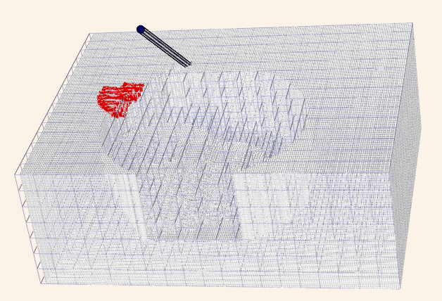
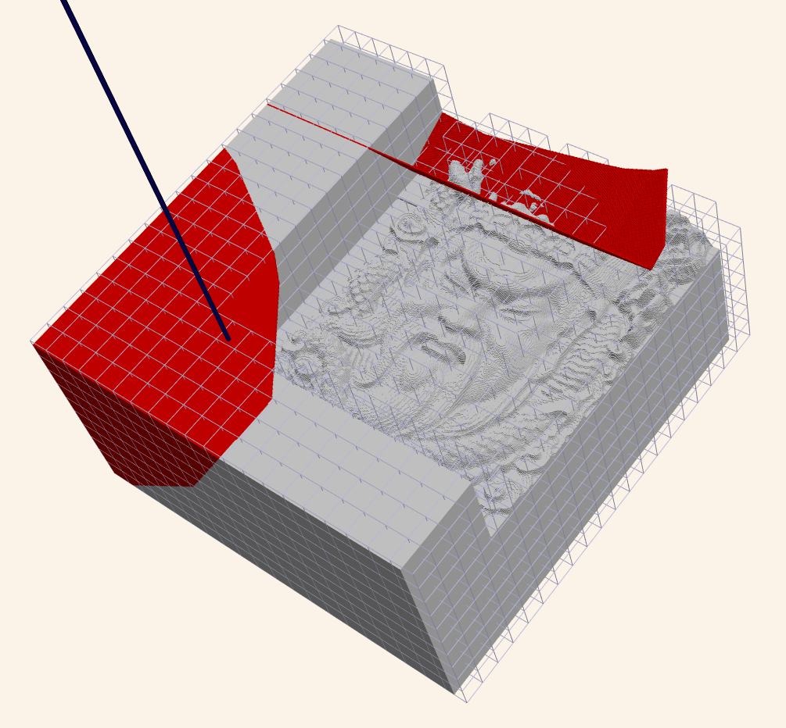



# Innovative GPU-Based Milling/Collision Simulator 🚀

---

## The Challenge 😟

The milling process involves a **sequential dependency**:

At each time step ```t = j```, the material shape depends on all previous steps  ```t = 0``` to ```t = j - 1```).

**To compute collisions**: A typical simulator runs sequentially, leading to a complexity of ```~O(N)```, where 
```N ~ 10^6``` for complex shapes.

Even with parallel collision detection at a single time step, the **sequential nature remains a bottleneck**. 😔

---

## Existing Solutions 🛠️  

CAM software typically **computes collisions at specific time windows** to speed up the simulation:

- ⚠️ Risks **false positives** for collisions.  
- ⚠️ Produces **suboptimal tool paths**: To avoid potential collisions, CAM programmers often prioritize safety over 
  efficiency, leading to suboptimal paths. Additionally, **significant time is wasted visually inspecting for potential 
  collisions** during time windows.

---

## Our Solution 💡

We developed an **innovative, fully parallelizable algorithm** using a **reduction operation/error-correction method**:  

- Transforms the sequential problem into a **fully parallel** one with complexity ```O( log N)```.  
- **Implemented entirely on the GPU** for maximum performance.
- **EU/USA patents granted** 

**Our Approach**:

- 🚀 Achieves **significant speedup through full-time parallelization** using CUDA cores and stream parallelism.
- 🚀 **Enables more optimal tool paths**, allowing CAM programmers to focus on path optimization. Collisions are flagged 
  automatically, specifying the exact time and location of the issue. 

To implement our algorithm, **we have developed a milling and collision simulation from scratch using CUDA/C++** for 
high-performance computations and a simple rendering visualizer built with **VTK**.

---

## Simulation Overview 🛠️  
Our simulator employs a **two-level voxel model**:  
- **L1**: Coarse-grained voxelization for efficient broad-phase detection (big blue voxels).  
- **L2**: Fine-grained voxelization for detailed collision resolution (small withe voxels).

<div class="lightbox-image">
    
</div>

Check out the video below to see it in action! 🎥 . Here, a 5-axis CNC machine demonstrates collision detection, 
with collisions highlighted in **red voxels**.

<html lang="en">
<head>
    <meta charset="UTF-8">
    <meta name="viewport" content="width=device-width, initial-scale=1.0">
    <title>Video Section Example</title>
    <style>
        /* Styles for the video container */
        .video-container {
            text-align: left;
            margin: 10px 0;
        }
    </style>
</head>
<body>
    <!-- Video Section -->
    <div class="video-container">
        <video width="340" height="360" controls>
            <source src="../../assets/videos/cnc_simul.webm" type="video/webm">
            Your browser does not support the video tag.
        </video>
    </div>
</body>
</html>


The video demonstrates a simple example with a relatively large L2 voxel size for demonstration purposes. 
However, **our simulator is capable of handling much more complex cases**, such as the one shown below:

<div class="lightbox-image">
    
</div>


- **~4 million toolpath positions** simulated on a **laptop with an RTX4060 GPU (8GB)**.  
- Two-level voxel model:  
  - **L1:** 20x20 voxel layer.  
  - **L2:** 30x30 voxel layer with a **0.1 mm voxel size**.  
- Same 5-axis CNC machine as in the video.  

We leverage **CUDA stream parallelization** for further improved single GPU parallelization performance, achieving the 
following speed-ups:

- **1 stream: 344499 milliseconds**  
- **2 streams: 202646 milliseconds**   
- **4 streams: 198754 milliseconds**   

> **Note:** In this example, only the **tool holder** is used for collision detection to manage GPU memory. 
> If the GPU is overloaded with the full mesh data of all machine surfaces, as this is a small GPU, 
> the limited resources (e.g., CUDA cores and memory) would force streams to execute sequentially, reducing the 
> benefits of stream  parallelization. This can be seen for 4 streams where the speedup doesn't increase beyond the 
> 2 stream case. Instead, from 1 to 2 streams the speedup is around 1.7. Nevertheless, with **multiple GPUs**, the full 
> simulation (including all machine surfaces) would again demonstrate significant stream parallelization speed-ups.  

---

## Key Features 🌟  

---

### Collision Detection  
The simulation leverages advanced techniques to ensure accurate and efficient collision detection:  
- **Rigid body collision detection** for each time step.  
- **GPU-optimized BVH trees** and acceleration techniques to identify potential collision targets.  
- **Primitive shape intersections**, such as **triangle-voxel**, to detect actual collisions:
  - Between machine surfaces and the voxelized workpiece.  
  - Between complex tools and surface primitives.  

---

### Optimization Strategy  
Our approach focuses on **time-parallelization**, avoiding traditional bottlenecks:  
- Unlike traditional CAM solutions that optimize collision detection (a sequential bottleneck), our method 
- **parallelizes across time steps**.  
- We refine the **time-parallelization algorithm** for maximum efficiency.
- The algorithm can use multiple GPUs but also multiple streams within a single GPU for task parallelism in order to
  speed up our time parallel simulation.

To implement the two-level voxelization, we adopted the method from the paper 
[Fast parallel surface and solid voxelization on GPUs](https://dl.acm.org/doi/abs/10.1145/1882261.1866201). For a simplified version (single-level voxelization), 
check out my [voxelizer repo](#).  

---

### Template Metaprogramming with CUDA/C++ 💡  

To achieve a clean, object-oriented design while adhering to the **SOLID principles** at the CUDA level:

- We use **template metaprogramming** to mimic **dependency injection** at compile time.
- This approach eliminates runtime overhead while maintaining performance and flexibility.

The code looks like this:

Given the interface `ITwoLevelVoxelModel`, we use the implementation `TwoLevelModelSimple`, as shown in the examples 
above. This is the voxel model for the workpiece.

```cpp
typedef ITwoLevelVoxelModel<TwoLevelModelSimple> VoxelModel;
```

`IMillingArchitecture` is the interface associated with the parallelization type, such as multiple GPU time 
parallelization (`MillingParallelNcMultiGpu`), which uses our algorithm, or a time-sequential one (`MillingSerialNc`), 
as done in standard CAM software.

``` cpp
typedef IMillingArchitecture<MillingParallelNcMultiGpu, VoxelModel> MillingArch;     
//typedef IMillingArchitecture<MillingSerialNc, VoxelModel> MillingArch;   
```

`IMachineKinematics` defines the kinematics of the machine. In the example above, we used a 5-axis configuration, but 
it could also be a 3+2-axis or 3-axis machine, etc.

``` cpp
typedef IMachineKinematics<FiveAxisKinematics> MachineKinematics;
```

Finally, we create the Machine to run the simulation.

``` cpp
typedef MachineBasic<IMachineKinematics, MillingArch, VoxelModel> MachineBasic;
```

---

**BONUS:** 

Leverage this high-speed simulator to **optimize toolpaths** further using advanced techniques such as 
**Reinforcement Learning** to enhance performance and accuracy even more. This is still a work in progress (WIP). 😊


<a href="/ivan-homepage/">
    <button style="padding:10px 20px; background-color:#007BFF; color:white; border:none; border-radius:5px; cursor:pointer;">
        Back to Home
    </button>
</a>


<!-- Place this code block at the end of your Markdown file -->
<style>
    .lightbox-image {
        display: inline-block;
        margin: 10px;
        cursor: pointer;
    }
    
    .lightbox-image img {
        max-width: 300px;
        transition: transform 0.3s ease;
        display: block;
    }
    
    .lightbox-image img:hover {
        transform: scale(1.05);
    }
    
    #global-lightbox {
        display: none;
        position: fixed;
        z-index: 9999;
        left: 0;
        top: 0;
        width: 100%;
        height: 100%;
        background-color: rgba(0, 0, 0, 0.9);
        justify-content: center;
        align-items: center;
    }
    
    #global-lightbox img {
        max-width: 90%;
        max-height: 90vh;
        object-fit: contain;
    }
    
    #lightbox-close {
        position: absolute;
        top: 20px;
        right: 30px;
        color: white;
        font-size: 30px;
        cursor: pointer;
        font-weight: bold;
    }
</style>

<!-- Single lightbox container for all images -->
<div id="global-lightbox">
    <span id="lightbox-close">&times;</span>
    
</div>

<script>
    // Create lightbox container if it doesn't exist
    if (!document.getElementById('global-lightbox')) {
        const lightboxHTML = `
            <div id="global-lightbox">
                <span id="lightbox-close">&times;</span>
                
            </div>
        `;
        document.body.insertAdjacentHTML('beforeend', lightboxHTML);
    }

    // Initialize lightbox functionality
    function initializeLightbox() {
        const lightbox = document.getElementById('global-lightbox');
        const lightboxImage = document.getElementById('lightbox-current-image');
        const closeBtn = document.getElementById('lightbox-close');

        // Add click handlers to all lightbox images
        document.querySelectorAll('.lightbox-image img').forEach(img => {
            img.addEventListener('click', function() {
                lightbox.style.display = 'flex';
                lightboxImage.src = this.src;
                lightboxImage.alt = this.alt;
            });
        });

        // Close handlers
        closeBtn.addEventListener('click', () => lightbox.style.display = 'none');
        lightbox.addEventListener('click', (e) => {
            if (e.target === lightbox) lightbox.style.display = 'none';
        });
    }

    // Initialize when the page loads
    if (document.readyState === 'loading') {
        document.addEventListener('DOMContentLoaded', initializeLightbox);
    } else {
        initializeLightbox();
    }
</script>
